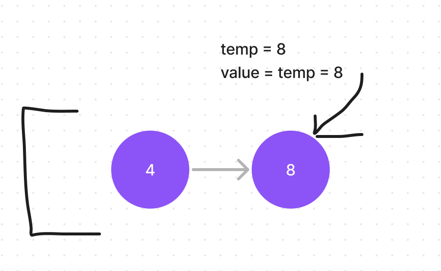
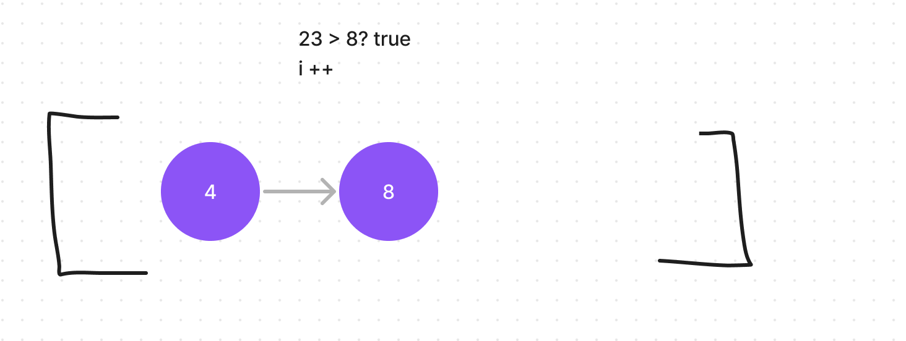
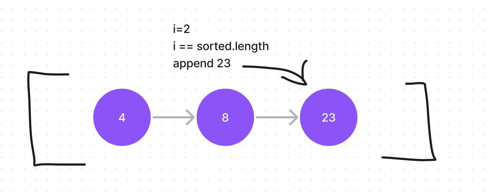
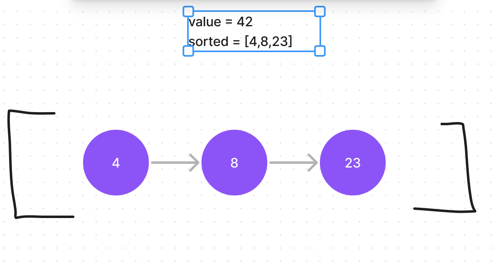
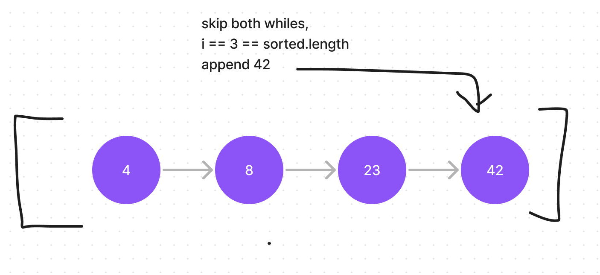
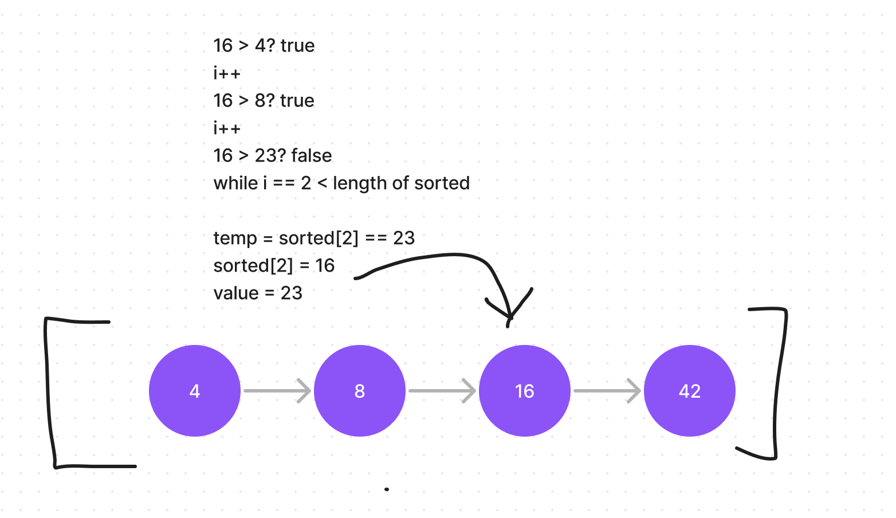
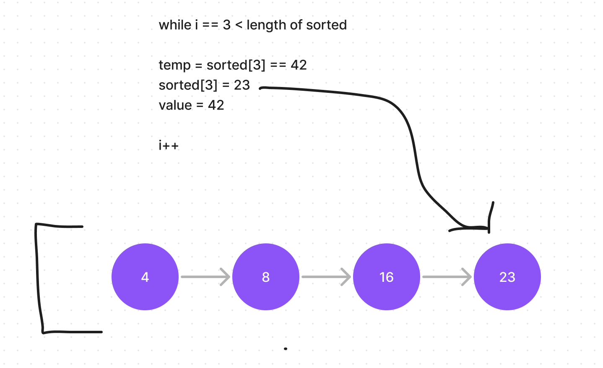

# Insert Sorted

The insertion sort algorithm uses two methods two sort an array.

First a new array is declared, and then the index at 0 is added to the new array.
Then a for loop is used  from index 1 through the input array length.
Inside the for loop, the Insert method is called using the new array and the value at i of the input index.

A counter is initialized and counts up on depending on whether the value is higher than the value at sorted[i].
Since there is only one value to compare, and the length is equal to i,we skip the while loop and append the input value.


We follow this method for the next input value of 23...


First accumulating with while loop...



We skip the second while loop since i is equal to the array length.  This always happens when the value is higher than
all the values in the array.



So then we append the value to the end.



The next iteration with 43 is similar to the last one since 43 is already higher than all the numbers in the array..



So we pass the whiles and append to the end.



The next iteration is 16, which will require true insert logic.  We count up till the point where 16 should be inserted
with the while loop. then we set a temp to the number that was higher than 16. We then insert 16 where the higher number was.
We then change the new value to the temp.



This reiterates up till the length of the array using the counter. This process essentially moves each of the rest the indexes down by
1 index, and appends the final value as the last index.
Finally, the for loop is terminated and the new sorted array is returned.


```

public void (int[] sorted, int value) {
int i = 0;

while (i < sorted[i])
  i++;

while (i < sorted.length) {
  temp = sorted[i];
  sorted[i] = value;
  value = temp;
  }
sorted.append(value);
}

public int[] InsertionSort {
  int[] sort = new Array[];
  sorted[0] = input[0];
  for (int i = 1; i < input.length; i++) {
    Insert(sorted, input[i]);
  }
  return sorted;
}
```
