# Merge Sort

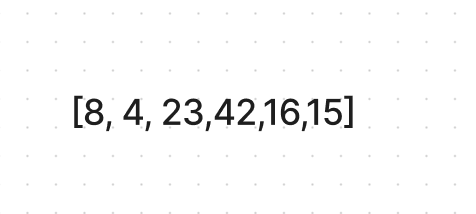
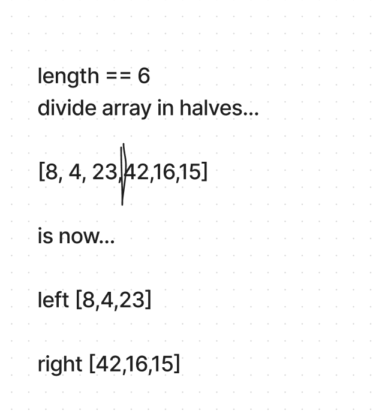
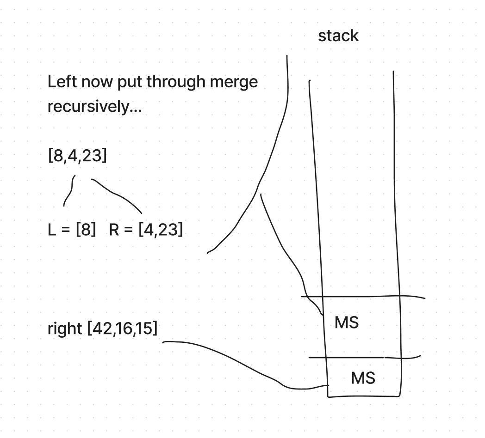
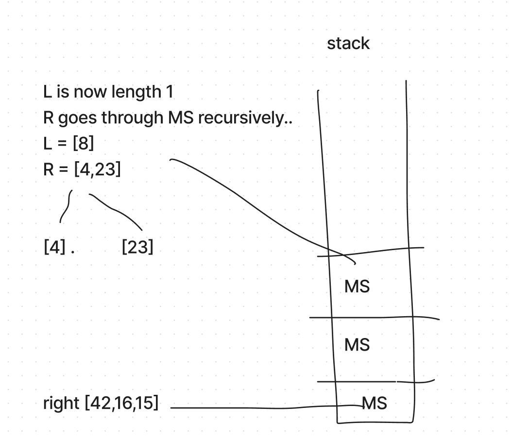
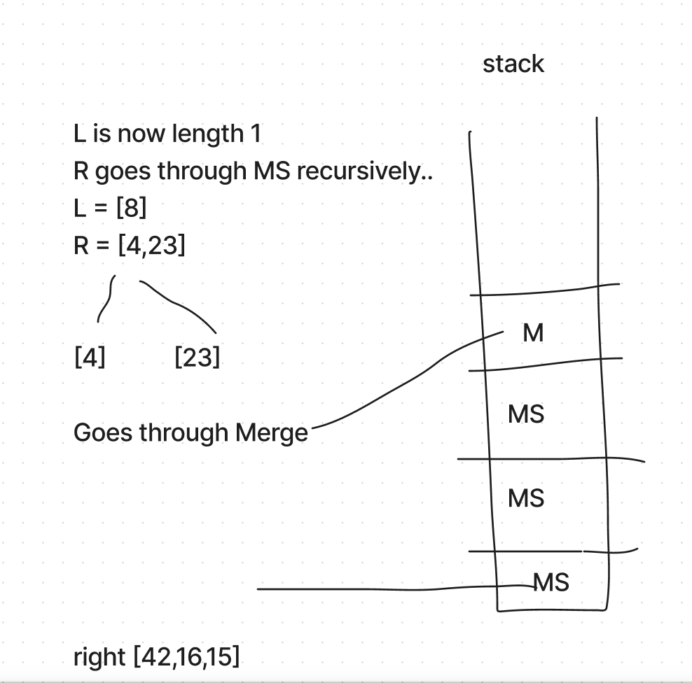
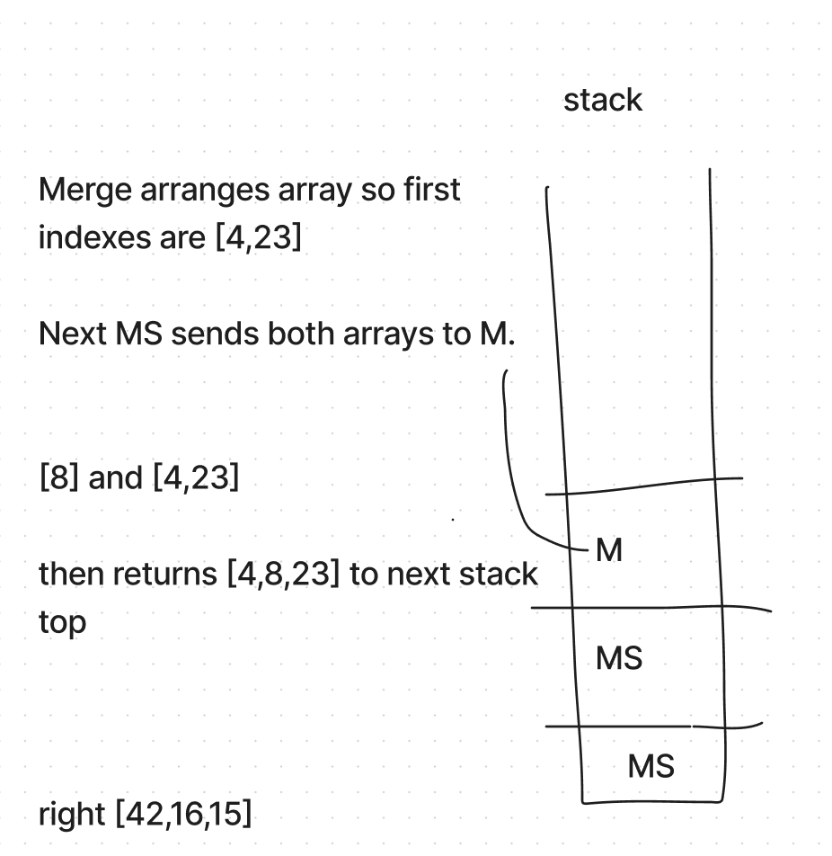
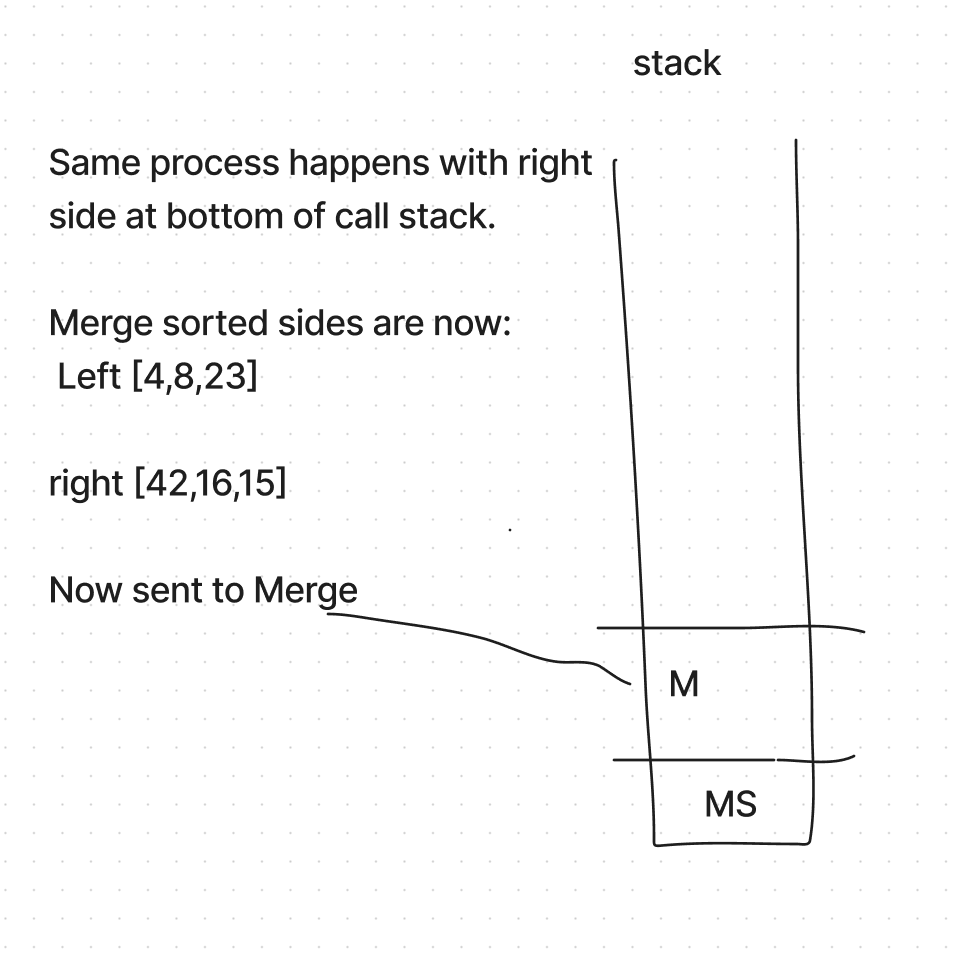
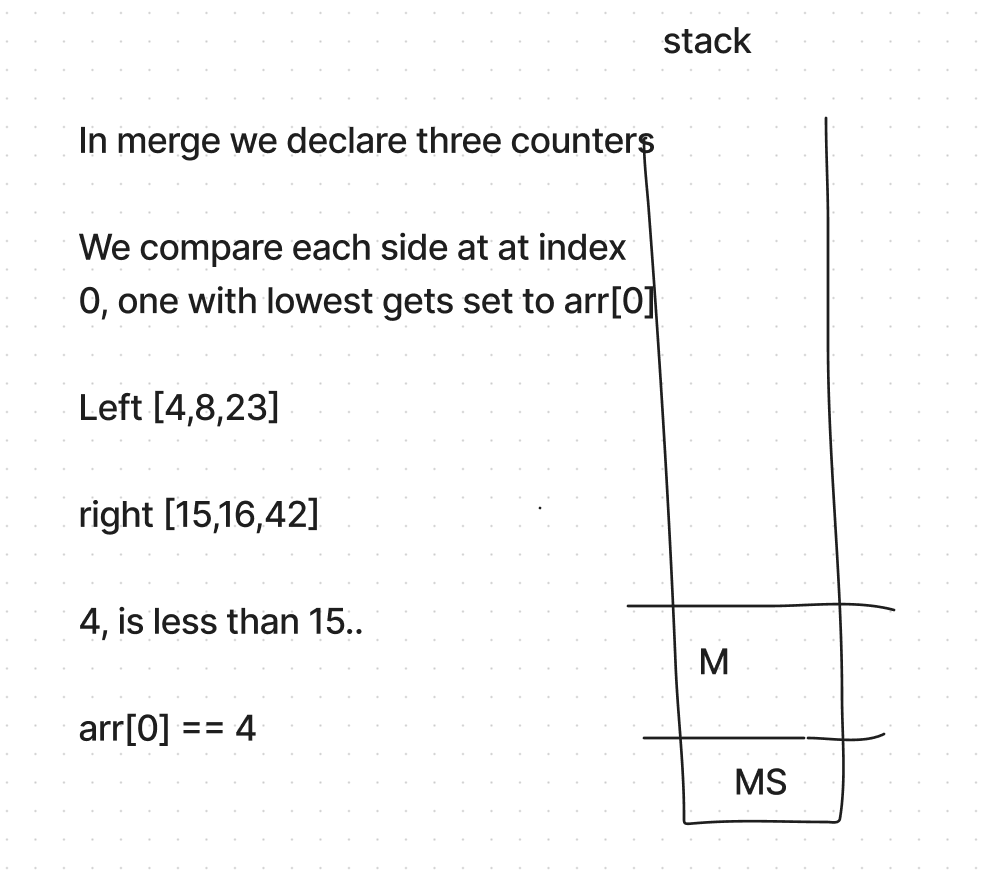
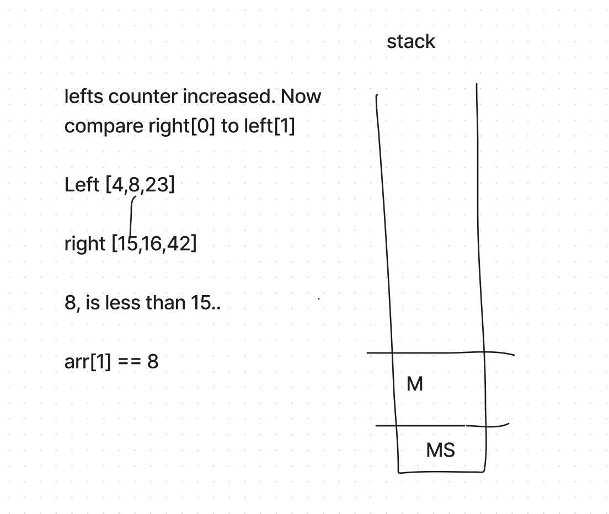
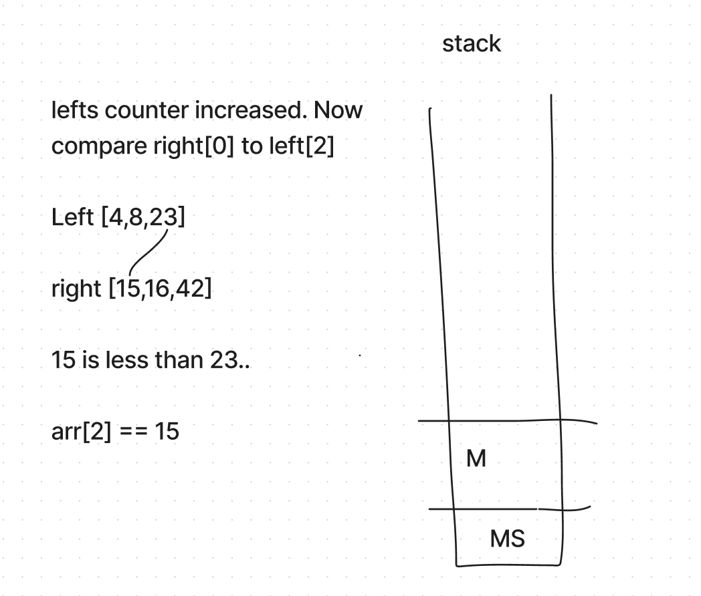
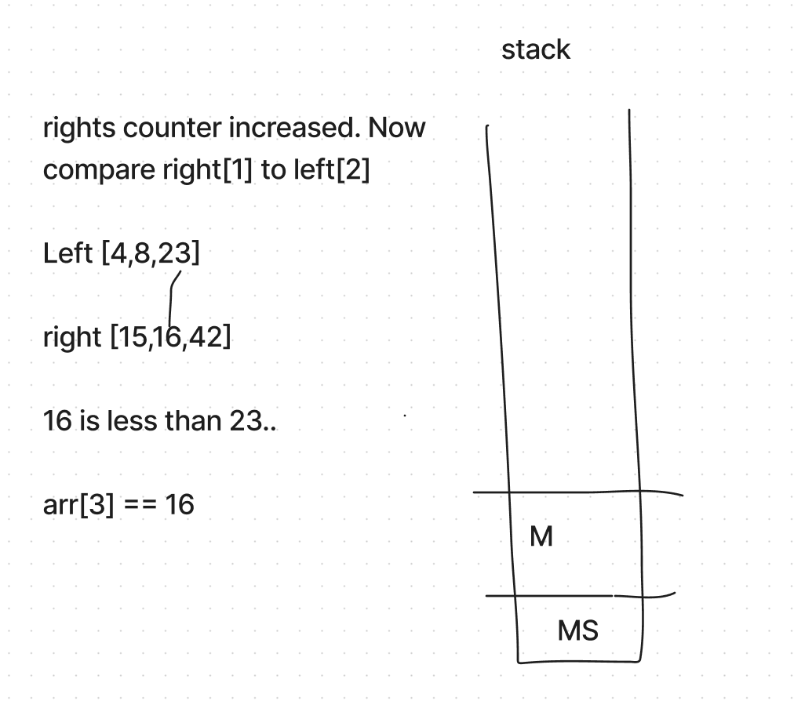
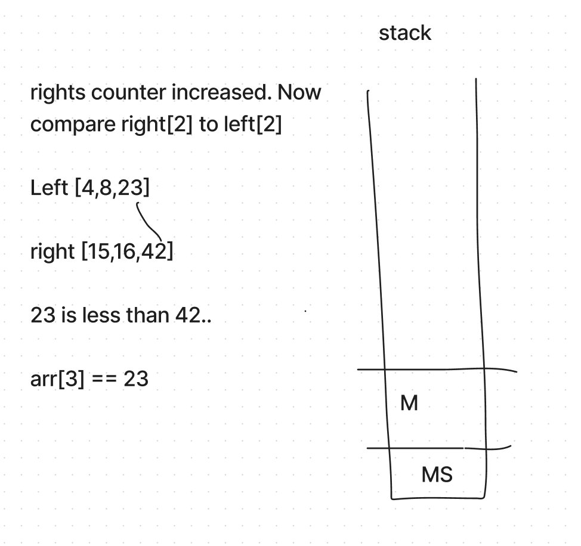
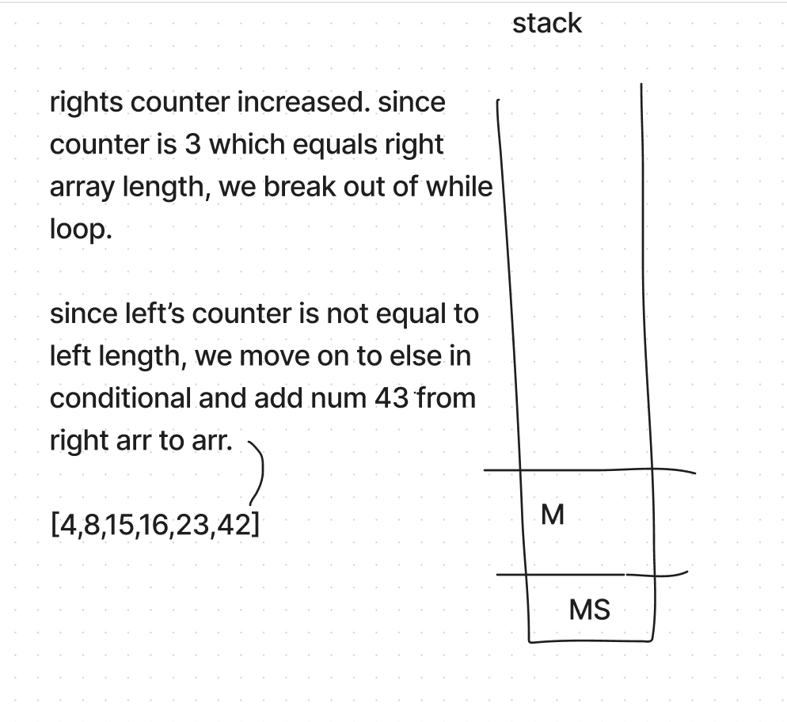

```

public void mergSort(int[] arr) {
  int n = arr.length;

  if (n > 1) {
    int mid = n/2;
    int[] left = arr[0 ... mid];
    int[] right = arr[0...mid];

    mergeSort(left);

    mergeSort(right);

    merge(left,right, arr);
    }
}

public void merge(int[] left, int[] right, int[] arr) {

  int i = 0;
  int j = 0;
  int k = 0;

  while (i < left.length && j <right.length) {
    if (left[i] <= right[j] {
      arr[k] = left[i];
      i++;
      } else {
        arr[k] = right[j];
        j++;
    k++;

  }

  if (i == left.length) {
    for (i; i < arr.length; i++) {
      arr.push(left[i]);
      }
    } else {
       for (i; i < arr.length; i++) {
      arr.push(right[i]);
      }
}


```

