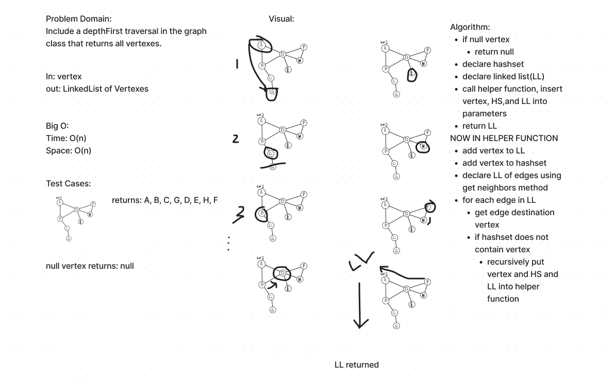

# Graphs

In this instantiation of graphs, we have several methods:

addNode()
adds a vertex to the graph, but doesn't connect it.

addEdge()
specify vertexes and connect them with a weight

getNodes()
prompts an adjacency list for all the nodes

getNeighbors()
prompts adjacency list just for a vertexes neighbors

size()
returns number of vertices

WhiteBoard for CC 38

